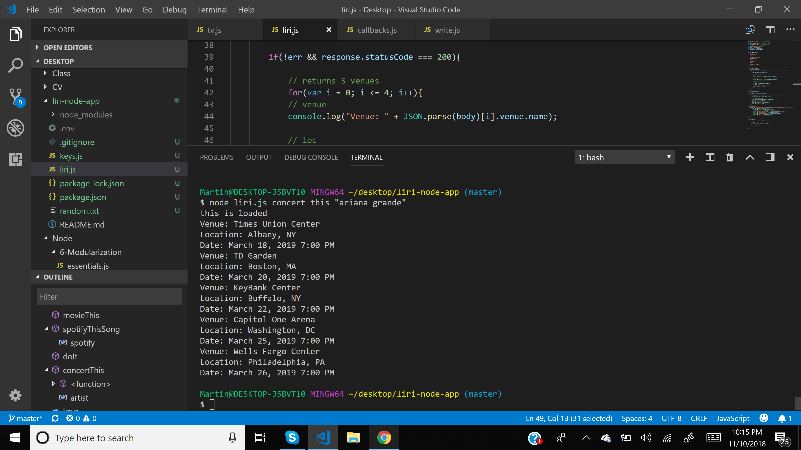

# liri-node-app

**What does it do?** 
* LIRI is like iPhone's SIRI. However, while SIRI is a Speech Interpretation and Recognition Interface, LIRI is a Language Interpretation and Recognition Interface. LIRI will be a command line node app that takes in parameters and gives you back data.

## List of Commands

1. concert-this

*node liri.js concert-this "artist name"*
 
 returns concert info using bandsintown API
 * Venue
 * Location
 * Date and Time
 

2. spotify-this-song

*node liri.js spotify-this-song "any song"*

returns information of given song using spotify API
* Artist Name
* Link of song preview on Spotify
* Album

3. movie-this

*node liri.js movie-this "any movie"*

returns movie information using OMDB API

* Movie Title
* Year
* Movie Rating
* Rotten Tomatoes Rating
* Country produced
* Language of the movie 
* Plot
* Actors

4. do-what-it-says

*node liri.js do-what-it-says*

reads file random.txt by requiring 'fs' and then call the command spotify-this-song

